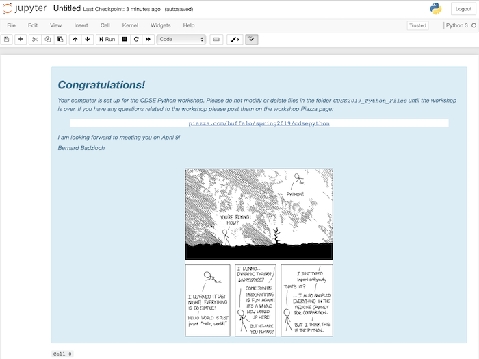

# CDSE Days 2018. 
# Python Workshop 


##  General instructions

* This will be a hands-on workshop - we will write code the entire time.
All participants need to bring laptops. Any operating system (Windows/Mac/Linux) is fine.
Instructions how to install software and some additional files we will need are posted below.

* I set up a [Piazza](http://piazza.com/buffalo/spring2019/cdsepython) page
for the workshop. Please sign up so you can post question before, during, and after
the workshop, or perhaps comment on questions posted by others.  


## Software installation

**1)** Install the [Anaconda distribution of Python 3.7](https://www.anaconda.com/download)
(be sure to select the Python 3.7 version).

If you have Anaconda previously installed, make sure that the you have either Python 3.6
or 3.7 and that you have fairly recent versions of the the Jupter Notebook and the following
Python packages: numpy, matplotlib, bokeh, pandas, requests, beautifulsoup4. Upgrade if needed.
If you are installing Anaconda for the first time, you don't need to worry about it, everything
is included in the distribution.  

**2)** A part of the Anaconda distribution is the Jupyter Notebook app.  It can be launched by typing 
`jupyter notebook` in a terminal (Mac and Linux)  or command prompt (Windows). Once you execute 
this command, a web browser should open showing Jupyter Notebook dashboard.  The following short
video demonstrated the basic Jupyter Notebook functionality:

<div align="center">
<iframe width="504" height="285" src="https://www.youtube.com/embed/BJnro9jQ3fE?end=188" frameborder="0" allow="accelerometer; autoplay; encrypted-media; gyroscope; picture-in-picture" allowfullscreen></iframe>
</div>

**3)** Launch Jupyter Notebook and open a new notebook. Copy the following code into an empty 
notebook code cell:

```
import requests
r = requests.get("https://git.io/fhxxf").text
with open("cdse_resources.py", 'w') as f: f.write(r)
import cdse_resources
```

**4)** Execute the cell by pressing the `Shift-Enter` keys. The code will download
a few files over the internet, so you need to be connected to the network before you
execute.

If everything goes fine, you will see a message that your computer is setup
for the workshop:



In case you run into difficulties please post a message on [Piazza](http://piazza.com/buffalo/spring2019/cdsepython).
